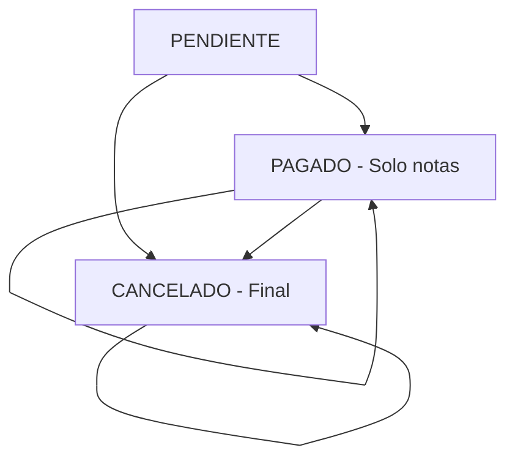

# Documentación de Vistas - Payments ViewSets

## Visión General

La aplicación payments utiliza Django REST Framework ViewSets para proporcionar una API RESTful completa. El ViewSet principal (`PagoViewSet`) maneja todas las operaciones CRUD y funcionalidades adicionales para la gestión de pagos del salón de uñas.

## Archivos Principales

**Ubicación**: `apps/payments/views/`

- `pago_views.py` - ViewSet principal para pagos

## PagoViewSet

### Definición de Clase

```python
class PagoViewSet(viewsets.ModelViewSet):
    """
    ViewSet para gestionar pagos
    """
    queryset = Pago.objects.all()
    permission_classes = [IsAuthenticated]
    filter_backends = [DjangoFilterBackend, filters.SearchFilter, filters.OrderingFilter]
    filterset_fields = ["estado_pago", "metodo_pago", "cita"]
    search_fields = ["notas_pago", "referencia_pago"]
    ordering_fields = ["fecha_pago", "fecha_creacion", "monto_total"]
    ordering = ["-fecha_pago"]
```

### Configuración Base

| Atributo             | Valor                                             | Descripción                               |
| -------------------- | ------------------------------------------------- | ----------------------------------------- |
| `queryset`           | `Pago.objects.all()`                              | Conjunto base de datos                    |
| `permission_classes` | `[IsAuthenticated]`                               | Requiere autenticación                    |
| `filter_backends`    | Lista de backends                                 | Habilita filtros, búsqueda y ordenamiento |
| `filterset_fields`   | `["estado_pago", "metodo_pago", "cita"]`          | Campos filtrables                         |
| `search_fields`      | `["notas_pago", "referencia_pago"]`               | Campos buscables                          |
| `ordering_fields`    | `["fecha_pago", "fecha_creacion", "monto_total"]` | Campos ordenables                         |
| `ordering`           | `["-fecha_pago"]`                                 | Ordenamiento por defecto                  |

## Métodos Principales

### `get_serializer_class(self)`

```python
def get_serializer_class(self):
    """
    Retornar el serializer apropiado según la acción
    """
    if self.action == "list":
        return PagoListSerializer
    elif self.action == "create":
        return PagoCreateSerializer
    return PagoSerializer
```

**Propósito**: Determina qué serializer usar según la acción:

- **Lista**: `PagoListSerializer` (datos simplificados para listados)
- **Creación**: `PagoCreateSerializer` (campos específicos para crear)
- **Otras acciones**: `PagoSerializer` (datos completos)

### `get_queryset(self)`

```python
def get_queryset(self):
    """
    Filtrar pagos según parámetros de consulta
    """
    queryset = Pago.objects.select_related('cita', 'cita__cliente', 'creado_por')

    # Filtro por estado de pago
    estado_pago = self.request.query_params.get("estado_pago", None)
    if estado_pago is not None:
        queryset = queryset.filter(estado_pago=estado_pago)

    # Filtro por método de pago
    metodo_pago = self.request.query_params.get("metodo_pago", None)
    if metodo_pago is not None:
        queryset = queryset.filter(metodo_pago=metodo_pago)

    # Filtro por cita específica
    cita = self.request.query_params.get("cita", None)
    if cita is not None:
        queryset = queryset.filter(cita_id=cita)

    # Filtro por rango de fechas
    fecha_desde = self.request.query_params.get("fecha_desde", None)
    if fecha_desde is not None:
        try:
            fecha_desde = parse_date(fecha_desde)
            queryset = queryset.filter(fecha_pago__date__gte=fecha_desde)
        except ValueError:
            pass

    fecha_hasta = self.request.query_params.get("fecha_hasta", None)
    if fecha_hasta is not None:
        try:
            fecha_hasta = parse_date(fecha_hasta)
            queryset = queryset.filter(fecha_pago__date__lte=fecha_hasta)
        except ValueError:
            pass

    # Filtro por monto mínimo
    monto_minimo = self.request.query_params.get("monto_minimo", None)
    if monto_minimo is not None:
        try:
            monto_minimo = Decimal(monto_minimo)
            queryset = queryset.filter(monto_total__gte=monto_minimo)
        except (ValueError, InvalidOperation):
            pass

    # Filtro por monto máximo
    monto_maximo = self.request.query_params.get("monto_maximo", None)
    if monto_maximo is not None:
        try:
            monto_maximo = Decimal(monto_maximo)
            queryset = queryset.filter(monto_total__lte=monto_maximo)
        except (ValueError, InvalidOperation):
            pass

    return queryset
```

**Propósito**: Aplica filtros dinámicos según parámetros de consulta:

- **Optimización**: Usa `select_related()` para evitar consultas N+1
- **Filtros básicos**: Estado, método, cita específica
- **Filtros avanzados**: Rango de fechas, rango de montos
- **Validación**: Maneja errores de conversión de tipos

### `perform_create(self, serializer)`

```python
def perform_create(self, serializer):
    """
    Crear pago con usuario actual y validaciones adicionales
    """
    # Validar que la cita no esté cancelada
    cita = serializer.validated_data['cita']
    if cita.estado_cita == 'CANCELADA':
        raise ValidationError("No se puede crear un pago para una cita cancelada")

    # Asignar fecha de pago si no se proporciona
    if 'fecha_pago' not in serializer.validated_data:
        serializer.validated_data['fecha_pago'] = timezone.now()

    # Asignar usuario creador
    serializer.save(creado_por=self.request.user)
```

**Propósito**: Maneja la lógica de creación de pagos:

- **Validaciones**: Verifica que la cita esté en estado válido
- **Defaults**: Asigna fecha actual si no se proporciona
- **Auditoría**: Registra el usuario que crea el pago

### `perform_update(self, serializer)`

```python
def perform_update(self, serializer):
    """
    Validar estado del pago antes de actualizar
    """
    pago = self.get_object()

    # Validar que el pago se pueda modificar
    if pago.estado_pago == 'CANCELADO':
        raise ValidationError("No se pueden modificar pagos cancelados")

    # Si el pago está pagado, solo permitir modificar notas
    if pago.estado_pago == 'PAGADO':
        campos_permitidos = ['notas_pago']
        for campo in serializer.validated_data.keys():
            if campo not in campos_permitidos:
                raise ValidationError(f"No se puede modificar '{campo}' en un pago completado")

    serializer.save()
```

**Propósito**: Controla las actualizaciones según reglas de negocio:

- **Estados finales**: Impide modificación de pagos cancelados
- **Restricciones**: Limita modificaciones en pagos completados
- **Integridad**: Mantiene consistencia de datos

### `perform_destroy(self, instance)`

```python
def perform_destroy(self, instance):
    """
    Validar que el pago se pueda eliminar
    """
    if instance.estado_pago == 'PAGADO':
        raise ValidationError("No se pueden eliminar pagos completados")

    instance.delete()
```

**Propósito**: Controla la eliminación según reglas de negocio:

- **Protección**: Impide eliminar pagos completados
- **Integridad**: Mantiene historial de pagos importantes

## Endpoints Estándar (ModelViewSet)

### 1. Listar Pagos

**Endpoint**: `GET /api/pagos/`

**Funcionalidad**:

- Lista todos los pagos con paginación
- Aplica filtros y búsquedas
- Utiliza `PagoListSerializer` para datos optimizados

**Parámetros de Consulta**:

| Parámetro      | Tipo    | Descripción                  | Ejemplo                   |
| -------------- | ------- | ---------------------------- | ------------------------- |
| `estado_pago`  | String  | Filtrar por estado           | `?estado_pago=PAGADO`     |
| `metodo_pago`  | String  | Filtrar por método           | `?metodo_pago=EFECTIVO`   |
| `cita`         | Integer | Filtrar por cita específica  | `?cita=123`               |
| `fecha_desde`  | Date    | Fecha mínima (YYYY-MM-DD)    | `?fecha_desde=2025-01-01` |
| `fecha_hasta`  | Date    | Fecha máxima (YYYY-MM-DD)    | `?fecha_hasta=2025-12-31` |
| `monto_minimo` | Decimal | Monto mínimo                 | `?monto_minimo=10000`     |
| `monto_maximo` | Decimal | Monto máximo                 | `?monto_maximo=50000`     |
| `search`       | String  | Búsqueda en notas/referencia | `?search=adelanto`        |
| `ordering`     | String  | Ordenamiento                 | `?ordering=-monto_total`  |
| `page`         | Integer | Página para paginación       | `?page=2`                 |
| `page_size`    | Integer | Elementos por página         | `?page_size=20`           |

**Respuesta**:

```json
{
  "count": 45,
  "next": "http://api/pagos/?page=2",
  "previous": null,
  "results": [
    {
      "id": 123,
      "pago_id": 123,
      "cita": 456,
      "cliente_nombre": "María González",
      "fecha_cita": "2025-08-25T10:00:00Z",
      "fecha_pago": "2025-08-23T14:30:00Z",
      "monto_total": "25000.00",
      "monto_formateado": "$25,000",
      "metodo_pago": "EFECTIVO",
      "estado_pago": "PAGADO",
      "notas_pago": "Pago completo del servicio",
      "referencia_pago": null,
      "fecha_creacion": "2025-08-23T14:30:00Z",
      "fecha_actualizacion": "2025-08-23T14:30:00Z"
    }
  ]
}
```

### 2. Crear Pago

**Endpoint**: `POST /api/pagos/`

**Funcionalidad**:

- Crea un nuevo pago
- Utiliza `PagoCreateSerializer`
- Asigna automáticamente usuario creador y fecha si no se proporciona

**Datos de Entrada**:

```json
{
  "cita": 456,
  "monto_total": "25000.00",
  "metodo_pago": "TARJETA",
  "estado_pago": "PENDIENTE",
  "notas_pago": "Pago con tarjeta de crédito",
  "referencia_pago": "TXN-123456"
}
```

**Campos Opcionales**:

- `fecha_pago`: Si no se proporciona, usa la fecha/hora actual
- `estado_pago`: Si no se proporciona, usa "PENDIENTE"
- `notas_pago`: Campo opcional para observaciones
- `referencia_pago`: Campo opcional para referencia externa

**Respuesta** (201 Created):

```json
{
  "id": 124,
  "pago_id": 124,
  "cita": 456,
  "cita_info": {
    "cita_id": 456,
    "fecha_cita": "2025-08-25T10:00:00Z",
    "cliente_nombre": "María González",
    "estado_cita": "CONFIRMADA",
    "monto_total_cita": "25000.00"
  },
  "fecha_pago": "2025-08-23T15:00:00Z",
  "monto_total": "25000.00",
  "monto_formateado": "$25,000",
  "metodo_pago": "TARJETA",
  "estado_pago": "PENDIENTE",
  "referencia_pago": "TXN-123456",
  "notas_pago": "Pago con tarjeta de crédito",
  "es_pago_completo": true,
  "fecha_creacion": "2025-08-23T15:00:00Z",
  "fecha_actualizacion": "2025-08-23T15:00:00Z",
  "creado_por": 1
}
```

### 3. Obtener Detalle de Pago

**Endpoint**: `GET /api/pagos/{id}/`

**Funcionalidad**:

- Obtiene información completa de un pago específico
- Incluye información expandida de la cita
- Utiliza `PagoSerializer` completo

**Respuesta** (200 OK):

```json
{
  "id": 123,
  "pago_id": 123,
  "cita": 456,
  "cita_info": {
    "cita_id": 456,
    "fecha_cita": "2025-08-25T10:00:00Z",
    "cliente_nombre": "María González",
    "estado_cita": "COMPLETADA",
    "monto_total_cita": "25000.00"
  },
  "fecha_pago": "2025-08-23T14:30:00Z",
  "monto_total": "25000.00",
  "monto_formateado": "$25,000",
  "metodo_pago": "EFECTIVO",
  "estado_pago": "PAGADO",
  "referencia_pago": null,
  "notas_pago": "Pago completo del servicio",
  "es_pago_completo": true,
  "fecha_creacion": "2025-08-23T14:30:00Z",
  "fecha_actualizacion": "2025-08-23T14:30:00Z",
  "creado_por": 1
}
```

### 4. Actualizar Pago Completo

**Endpoint**: `PUT /api/pagos/{id}/`

**Funcionalidad**:

- Actualiza todos los campos del pago
- Aplica validaciones según el estado actual
- Requiere todos los campos obligatorios

**Datos de Entrada**:

```json
{
  "cita": 456,
  "fecha_pago": "2025-08-23T14:30:00Z",
  "monto_total": "25000.00",
  "metodo_pago": "EFECTIVO",
  "estado_pago": "PAGADO",
  "notas_pago": "Pago actualizado a efectivo",
  "referencia_pago": null
}
```

### 5. Actualizar Pago Parcial

**Endpoint**: `PATCH /api/pagos/{id}/`

**Funcionalidad**:

- Actualiza solo los campos enviados
- Aplica validaciones según el estado
- Mantiene el resto de campos sin cambios

**Datos de Entrada**:

```json
{
  "estado_pago": "PAGADO",
  "notas_pago": "Pago confirmado y procesado"
}
```

### 6. Eliminar Pago

**Endpoint**: `DELETE /api/pagos/{id}/`

**Funcionalidad**:

- Elimina un pago específico
- Valida que no esté en estado PAGADO
- Mantiene integridad referencial

**Respuesta** (204 No Content): Sin contenido

**Respuesta de Error** (400 Bad Request):

```json
{
  "error": "No se pueden eliminar pagos completados"
}
```

## Filtros Avanzados

### Combinación de Filtros

```bash
# Pagos pagados en efectivo de un rango de fechas
GET /api/pagos/?estado_pago=PAGADO&metodo_pago=EFECTIVO&fecha_desde=2025-08-01&fecha_hasta=2025-08-31

# Pagos de una cita específica
GET /api/pagos/?cita=456

# Pagos por rango de monto
GET /api/pagos/?monto_minimo=20000&monto_maximo=50000

# Búsqueda y filtros combinados
GET /api/pagos/?search=adelanto&estado_pago=PENDIENTE&ordering=-fecha_creacion
```

### Búsqueda por Texto

La búsqueda funciona en los campos:

- `notas_pago`: Busca en las observaciones del pago
- `referencia_pago`: Busca en la referencia externa

```bash
# Buscar pagos que mencionen "adelanto"
GET /api/pagos/?search=adelanto

# Buscar por referencia específica
GET /api/pagos/?search=TXN-123
```

### Ordenamiento

Campos disponibles para ordenamiento:

- `fecha_pago`: Fecha del pago
- `fecha_creacion`: Fecha de creación del registro
- `monto_total`: Monto del pago

```bash
# Más recientes primero (default)
GET /api/pagos/?ordering=-fecha_pago

# Montos más altos primero
GET /api/pagos/?ordering=-monto_total

# Más antiguos primero
GET /api/pagos/?ordering=fecha_creacion
```

## Estados de Pago y Validaciones

### Estados Permitidos

1. **PENDIENTE**: Estado inicial, permite todas las operaciones
2. **PAGADO**: Pago confirmado, permite solo modificar notas
3. **CANCELADO**: Pago cancelado, no permite modificaciones

### Reglas de Negocio

1. **Pagos completados**: No se pueden eliminar
2. **Pagos cancelados**: No se pueden modificar ni eliminar
3. **Citas canceladas**: No se pueden crear pagos para ellas
4. **Montos**: Deben ser positivos y mayores a cero
5. **Métodos**: Solo se permiten los predefinidos en choices

### Transiciones de Estado



## Paginación

Todas las listas utilizan paginación automática:

- **Tamaño por defecto**: 20 elementos por página
- **Tamaño máximo**: 100 elementos por página
- **Parámetros**: `page` y `page_size`

**Estructura de respuesta paginada**:

```json
{
  "count": 150,
  "next": "http://api/pagos/?page=3",
  "previous": "http://api/pagos/?page=1",
  "results": [...]
}
```

## Manejo de Errores

### Errores Comunes

| Error              | Código | Descripción                    | Solución                  |
| ------------------ | ------ | ------------------------------ | ------------------------- |
| Pago no encontrado | 404    | ID inexistente                 | Verificar ID válido       |
| Cita cancelada     | 400    | Crear pago para cita cancelada | Usar cita válida          |
| Monto inválido     | 400    | Monto cero o negativo          | Usar monto positivo       |
| Pago completado    | 400    | Intentar eliminar pago pagado  | No eliminar pagos pagados |
| Sin autenticación  | 401    | Token faltante o inválido      | Incluir token válido      |

### Formato de Errores

```json
{
  "field_name": ["Error message describing the issue"],
  "non_field_errors": ["General validation error"]
}
```

---

**Última actualización**: Agosto 2025  
**Versión**: 1.0  
**Estado**: ✅ Completamente funcional y probado
